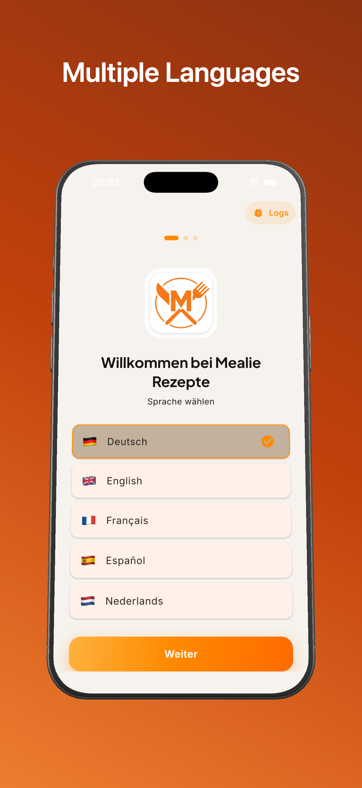
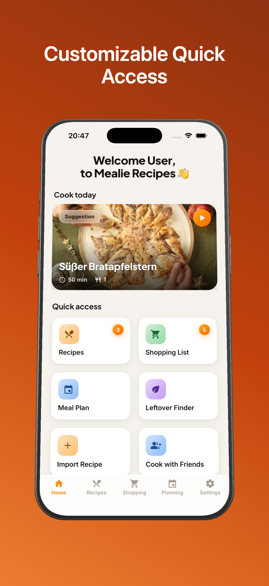
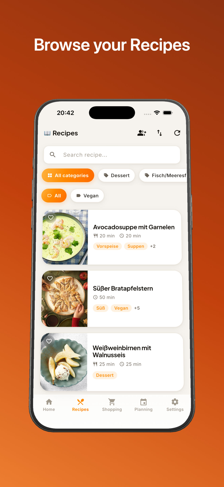
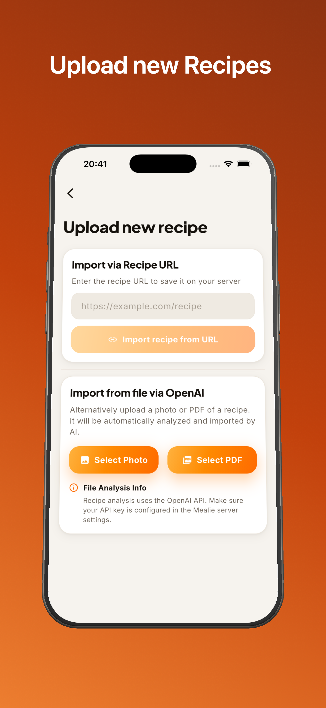
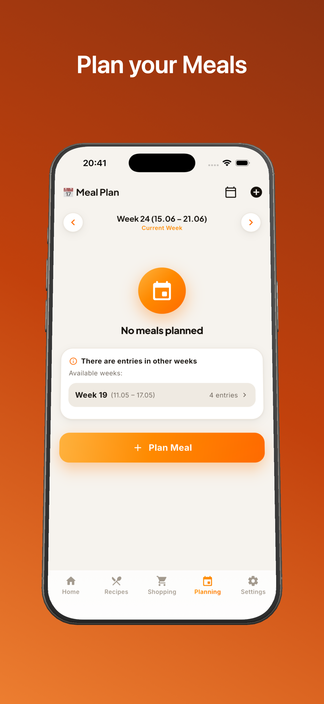
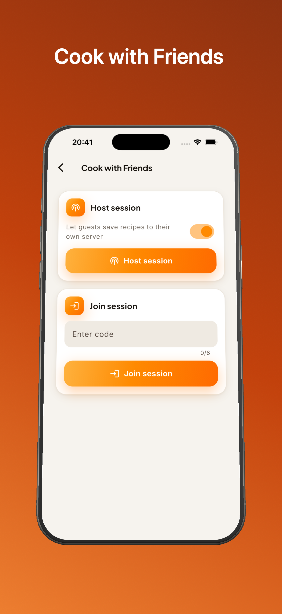
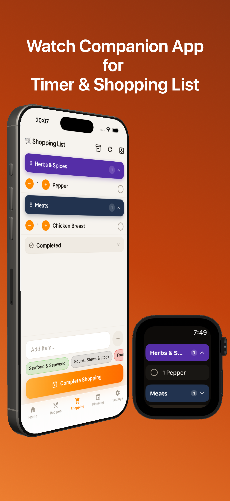

# 🍳 Mealie Recipes – The App for Your Mealie Server

<!-- Android badge note: to actually enforce Android 8.0 (API 26) as the minimum, set
     minSdk = 26 in android/app/build.gradle.kts (it currently inherits flutter.minSdkVersion). -->

**🌍 Language / Sprache:** [🇬🇧 English](#-english) · [🇩🇪 Deutsch](#-deutsch)

> ⚠️ **Note / Hinweis:** This is a third-party app and not an official product of the Mealie project; it requires your own running Mealie server. · Dies ist eine Drittanbieter-App und kein offizielles Mealie-Produkt; sie benötigt einen eigenen, laufenden Mealie-Server.

---

## 🇬🇧 English

**Manage your recipes seamlessly with your own Mealie server.** This app is the perfect companion for everyone who self-hosts Mealie and wants a native-feeling, fast, and beautiful interface for Android and iOS. Built with Flutter for a consistent experience across every platform — including your smartwatch!

☕ **Support appreciated** — if you like the app, I'd appreciate a small contribution on [Buy Me a Coffee](https://buymeacoffee.com/walfrosch92).

### Table of Contents

- [✨ Features](#features)
  - [📖 Discover & manage recipes](#f-recipes)
  - [📥 Import / upload recipes](#f-import)
  - [⏱️ Timers & cooking mode](#f-timers)
  - [⌚ Watch / companion apps](#f-watch)
  - [🛒 Shopping list](#f-shopping)
  - [📅 Meal plan](#f-mealplan)
  - [♻️ Leftover finder](#f-leftover)
  - [🤝 Share & cook together](#f-share)
  - [🔐 Security & access](#f-security)
  - [⚙️ Settings & personalization](#f-settings)
- [📸 Screenshots](#screenshots)
- [📱 Compatibility & requirements](#requirements)
- [🔒 Privacy & security](#privacy)
- [🛠 Technology](#technology)
- [⬇️ Download](#download)
- [🔗 Links](#links)

### ✨ Features

The app turns your recipe database into an interactive cooking experience.

#### 📖 Discover & manage recipes

- **Search & filter:** Full-text search, multi-select filters by category and tag (chips), sorting via a sort sheet, pull-to-refresh
- **Recipe detail:** Ingredients & instructions in tabs, prep/cook times, servings/yield, rating
- **Rate & favorite:** Star rating and favorite marking
- **Full editor:** Image upload, ingredients/units/foods with autocomplete, "re-parse ingredients" to repair broken/unparsed recipes
- **Delete recipes**
- **Recipe of the day:** A "Cook today" carousel on the home screen (shows meals planned for today, or a deterministic suggestion)

#### 📥 Import / upload recipes

- **Import from URL:** Automatically read web recipes (via Mealie's built-in recipe scraper)
- **Import from photo/image:** Gallery → text recognition through your Mealie server (OpenAI-powered, if the server is configured for it)
- **Import from PDF:** Extract recipes from PDF documents (PDF → image → same server endpoint)

#### ⏱️ Timers & cooking mode

- **Smart timers:** Run multiple timers in parallel during cooking mode, with a timer overlay bar
- **Multilingual timer detection:** Automatically detected from the instruction text
- **Notifications:** Local notification + alarm sound when a timer finishes
- **Live Activity (iOS):** Dynamic Island and lock-screen integration; tapping returns you to cooking mode
- **Ongoing Activity (Android):** Persistent in the notification shade
- **Timer controls:** Pause / resume / stop
- **Step-focused view:** Prepare ingredients → steps → done, with a progress indicator
- **Keep screen on:** Perfect while cooking
- **Serving scaling:** Carry scaled amounts over from the recipe view
- **Multi-recipe session:** Cook several recipes at once, session bar, flame FAB when paused

#### ⌚ Watch / companion apps

- **Apple Watch (watchOS):** Running timers visible, pause/stop from the wrist, alarm/haptics when finished
- **Wear OS (Android):** Timer control and shopping list on the watch
- **Shopping list on the watch:** Open items grouped by category (with colors), tap to check off directly

#### 🛒 Shopping list

- **Full management:** Add, check off, and delete items
- **Categories & labels:** Colored grouping and categorization
- **Add from recipe:** Add all or selected ingredients to the list
- **External imports:** Import from Google Tasks and Apple Reminders
- **Offline / sync:** Works without a connection and syncs later

#### 📅 Meal plan

- **Week view:** Navigate between weeks, jump to "today", date picker
- **Plan meals:** Plan and remove breakfast / lunch / dinner
- **Integration:** Feeds the "Cook today" widget on the home screen

#### ♻️ Leftover finder

- **Smart matching:** Enter ingredients → get matching recipe suggestions
- **Save time:** Use what you already have and reduce food waste

#### 🤝 Share & cook together

- **Cook Friends:** Shared cooking mode over mDNS + TCP, including image transfer
- **Guest mode:** Usable without your own server (Cook Friends / cooking mode only)
- **Recipe Send / SendTo:** Send recipes to nearby devices

#### 🔐 Security & access

- **Server setup:** Mealie URL + API token + household ID, with a connection test
- **Biometric app lock:** Face ID / fingerprint for extra security
- **Guest-mode gating:** Restricted access without your own server

#### ⚙️ Settings & personalization

- **Connection:** Server URL, token, household ID, selectable Mealie API version (v2.8 / v3)
- **HTTP headers:** Optional extra headers for special setups
- **Language:** German, English, Spanish, French, Dutch
- **Theme:** System / light / dark
- **Recipe images:** Show/hide
- **Shopping list:** Choose the active list, manage labels
- **App icon:** Switch (iOS only)
- **Developer:** Toggle logging, view/copy/clear logs, file size
- **Quick access:** Reorder home-screen tiles via drag, persisted

### 📸 Screenshots

| Setup | Home | Recipe list |
|:---:|:---:|:---:|
|  |  |  |

| Add a recipe | Meal plan | Cook with Friends |
|:---:|:---:|:---:|
|  |  |  |

| &nbsp; | Shopping list & Apple Watch | &nbsp; |
|:---:|:---:|:---:|
| |  | |

### 📱 Compatibility & requirements

**Phones & tablets**
- **Android:** Requires Android 8.0 (API level 26) or newer
- **iOS:** Requires iOS 17.6 or newer (home-screen widgets require iOS 18.6)

**Smartwatches**
- **watchOS:** Requires watchOS 10.0 or newer (Apple Watch)
- **Wear OS:** Requires Wear OS 3.0 or newer (API level 30)

**General**
- Optimized for phones, tablets, and smartwatches
- Size varies by platform and architecture

### 🔒 Privacy & security

- **No data collection:** The developer collects **no data** from you. The app runs entirely without tracking or analytics.
- **Direct connection:** You connect directly to your own Mealie server. The app acts only as a client; your recipes, shopping lists, and plans live on your server.
- **AI import:** Image and PDF imports are sent to **your Mealie server**. Only if that server is configured with an OpenAI-compatible API key does OpenAI process the data — the app itself never talks to OpenAI directly. URL import uses Mealie's built-in scraper with no AI involved. For the AI path, please review your provider's policies.
- **Biometric lock:** App access can optionally be protected with Face ID or fingerprint.
- **Local data:** Only your connection settings, the API token (stored in the secure keystore), and a cache for faster display are stored on the device.

### 🛠 Technology

This app is built with **Flutter**, Google's cross-platform framework. As a result it offers:

- **High performance:** Dart code is ahead-of-time compiled to native machine code, while the UI is drawn by Flutter's own rendering engine (Impeller/Skia) rather than platform widgets — for smooth, consistent visuals on every platform
- **Consistent UI:** A unified design across Android and iOS
- **Fast development:** New features land on all platforms at once
- **Platform-specific features:** Full integration of Live Activities / Dynamic Island (iOS) and Ongoing Activities (Android)

### ⬇️ Download

The app is available for free on the official **Apple App Store** and **Google Play Store**.

  
  &nbsp;&nbsp;
  

### 🔗 Links

- [Mealie Server](https://mealie.io/)
- [Mealie AI Providers (OpenAI setup)](https://docs.mealie.io/documentation/getting-started/installation/ai-providers/)
- [Flutter Framework](https://flutter.dev/)

Made with 🧡 by **Walfrosch92**

[⬆ Back to top](#top)

---

## 🇩🇪 Deutsch

**Verwalte deine Rezepte nahtlos mit deinem eigenen Mealie-Server.** Diese App ist der perfekte Begleiter für alle, die Mealie selbst hosten und eine nativähnliche, schnelle und schöne Oberfläche für Android und iOS suchen. Entwickelt mit Flutter für eine konsistente Erfahrung auf allen Plattformen – inklusive Smartwatch!

☕ **Unterstützung willkommen** — wenn dir die App gefällt, freue ich mich über eine kleine Unterstützung auf [Buy Me a Coffee](https://buymeacoffee.com/walfrosch92).

### Inhaltsverzeichnis

- [✨ Funktionen](#de-features)
  - [📖 Rezepte entdecken & verwalten](#de-f-recipes)
  - [📥 Rezepte importieren / hochladen](#de-f-import)
  - [⏱️ Timer & Kochmodus](#de-f-timers)
  - [⌚ Watch-/Companion-Apps](#de-f-watch)
  - [🛒 Einkaufsliste](#de-f-shopping)
  - [📅 Essensplan](#de-f-mealplan)
  - [♻️ Resteverwertung](#de-f-leftover)
  - [🤝 Teilen & gemeinsam kochen](#de-f-share)
  - [🔐 Sicherheit & Zugang](#de-f-security)
  - [⚙️ Einstellungen & Personalisierung](#de-f-settings)
- [📸 Screenshots](#de-screenshots)
- [📱 Kompatibilität & Anforderungen](#de-requirements)
- [🔒 Datenschutz & Sicherheit](#de-privacy)
- [🛠 Technologie](#de-technology)
- [⬇️ Download](#de-download)
- [🔗 Links](#de-links)

### ✨ Funktionen

Die App verwandelt deine Rezeptdatenbank in ein interaktives Kocherlebnis.

#### 📖 Rezepte entdecken & verwalten

- **Durchsuchen & Filtern:** Volltextsuche, Mehrfach-Filter nach Kategorien und Tags (Chips), Sortierung per Sortier-Sheet, Pull-to-Refresh
- **Rezept-Detail:** Zutaten & Anleitung in Tabs, Zubereitungszeiten, Portionen/Yield, Bewertung
- **Bewerten & Favorisieren:** Sterne-Bewertung und Favoriten-Markierung
- **Vollständiger Editor:** Bild-Upload, Zutaten/Einheiten/Foods mit Autocomplete, „Zutaten neu parsen" zum Reparieren beschädigter/ungeparster Rezepte
- **Rezepte löschen**
- **Rezept des Tages:** „Heute kochen"-Karussell auf dem Home-Screen (zeigt heute geplante Mahlzeiten oder einen deterministischen Vorschlag)

#### 📥 Rezepte importieren / hochladen

- **Import per URL:** Web-Rezept automatisch einlesen (über Mealies eingebauten Rezept-Scraper)
- **Import per Foto/Bild:** Galerie → Texterkennung über deinen Mealie-Server (OpenAI-gestützt, sofern der Server entsprechend konfiguriert ist)
- **Import per PDF:** Rezepte aus PDF-Dokumenten extrahieren (PDF → Bild → derselbe Server-Endpoint)

#### ⏱️ Timer & Kochmodus

- **Intelligente Timer:** Mehrere Timer parallel im Kochmodus, mit Timer-Overlay-Leiste
- **Mehrsprachige Timer-Erkennung:** Automatisch aus dem Anleitungstext erkannt
- **Benachrichtigungen:** Lokale Benachrichtigung + Alarmton bei Ablauf
- **Live Activity (iOS):** Dynamic-Island- und Sperrbildschirm-Integration; Tap führt zurück in den Kochmodus
- **Ongoing Activity (Android):** Persistent in der Benachrichtigungsleiste
- **Timer-Steuerung:** Pause / Fortsetzen / Stopp
- **Schrittfokussierte Ansicht:** Zutaten vorbereiten → Schritte → Fertig, mit Fortschrittsanzeige
- **Display bleibt an:** Perfekt zum Kochen
- **Portionen-Skalierung:** Skalierte Mengen aus der Rezeptansicht übernehmen
- **Multi-Rezept-Session:** Mehrere Rezepte gleichzeitig kochen, Session-Leiste, Flammen-FAB bei Pause

#### ⌚ Watch-/Companion-Apps

- **Apple Watch (watchOS):** Laufende Timer sichtbar, Pause/Stopp von der Uhr, Alarm/Haptik bei Ablauf
- **Wear OS (Android):** Timer-Steuerung und Einkaufsliste auf der Uhr
- **Einkaufsliste auf der Uhr:** Offene Artikel nach Kategorie gruppiert (mit Farben), direkt abhakbar

#### 🛒 Einkaufsliste

- **Vollständige Verwaltung:** Artikel hinzufügen, abhaken, löschen
- **Kategorien & Labels:** Farbige Gruppierung und Kategorisierung
- **Aus Rezept übernehmen:** Alle oder ausgewählte Zutaten zur Liste hinzufügen
- **Externe Importe:** Import aus Google Tasks und Apple Reminders
- **Offline-/Sync-Mechanik:** Funktioniert auch ohne Verbindung und synchronisiert später

#### 📅 Essensplan

- **Wochenansicht:** Navigation zwischen Wochen, „Heute"-Sprung, Datumsauswahl
- **Mahlzeiten planen:** Frühstück/Mittag/Abendessen planen und entfernen
- **Integration:** Speist das „Heute kochen"-Widget auf dem Home-Screen

#### ♻️ Resteverwertung

- **Intelligentes Matching:** Zutaten eingeben → passende Rezepte vorgeschlagen
- **Zeit sparen:** Vorhandene Zutaten nutzen und Lebensmittelverschwendung reduzieren

#### 🤝 Teilen & gemeinsam kochen

- **Cook Friends:** Gemeinsamer Kochmodus per mDNS + TCP, inkl. Bild-Übertragung
- **Gastmodus:** Ohne eigenen Server nutzbar (nur Cook Friends / Kochmodus)
- **Recipe Send / SendTo:** Rezepte an Geräte in der Nähe senden

#### 🔐 Sicherheit & Zugang

- **Server-Einrichtung:** Mealie-URL + API-Token + Household-ID, mit Verbindungstest
- **Biometrische App-Sperre:** Face ID / Fingerabdruck für zusätzliche Sicherheit
- **Gastmodus-Gating:** Eingeschränkter Zugriff ohne eigenen Server

#### ⚙️ Einstellungen & Personalisierung

- **Verbindung:** Server-URL, Token, Household-ID, wählbare Mealie-API-Version (v2.8 / v3)
- **HTTP-Header:** Optionale zusätzliche Header für spezielle Setups
- **Sprache:** Deutsch, Englisch, Spanisch, Französisch, Niederländisch
- **Theme:** System / Hell / Dunkel
- **Rezeptbilder:** Ein-/ausblenden
- **Einkaufsliste:** Aktive Liste wählen, Labels verwalten
- **App-Icon:** Wechseln (nur iOS)
- **Entwickler:** Logging ein/aus, Logs ansehen/kopieren/löschen, Dateigröße
- **Schnellzugriff:** Home-Screen-Kacheln per Drag umsortierbar, persistent

### 📸 Screenshots

| Einrichtung | Startseite | Rezeptliste |
|:---:|:---:|:---:|
|  |  |  |

| Rezept hinzufügen | Essensplan | Cook Friends |
|:---:|:---:|:---:|
|  |  |  |

| &nbsp; | Einkaufsliste & Apple Watch | &nbsp; |
|:---:|:---:|:---:|
| |  | |

### 📱 Kompatibilität & Anforderungen

**Smartphones & Tablets**
- **Android:** Erfordert Android 8.0 (API-Level 26) oder neuer
- **iOS:** Erfordert iOS 17.6 oder neuer (Home-Screen-Widgets benötigen iOS 18.6)

**Smartwatches**
- **watchOS:** Erfordert watchOS 10.0 oder neuer (Apple Watch)
- **Wear OS:** Erfordert Wear OS 3.0 oder neuer (API-Level 30)

**Allgemein**
- Optimiert für Smartphones, Tablets und Smartwatches
- Größe variiert je nach Plattform und Architektur

### 🔒 Datenschutz & Sicherheit

- **Keine Datenerfassung:** Der Entwickler erfasst **keinerlei Daten** von dir. Die App arbeitet komplett ohne Tracking und Analytics.
- **Direkte Verbindung:** Du verbindest dich direkt mit deinem eigenen Mealie-Server. Die App fungiert nur als Client; deine Rezepte, Einkaufslisten und Pläne liegen auf deinem Server.
- **KI-Import:** Bild- und PDF-Importe werden an **deinen Mealie-Server** gesendet. Nur wenn dieser mit einem OpenAI-kompatiblen API-Key konfiguriert ist, verarbeitet OpenAI die Daten — die App selbst spricht nie direkt mit OpenAI. Der URL-Import nutzt Mealies eingebauten Scraper ganz ohne KI. Beachte für den KI-Pfad die Richtlinien deines Anbieters.
- **Biometrische Sperre:** Der Zugriff auf die App lässt sich optional per Face ID oder Fingerabdruck schützen.
- **Lokale Daten:** Auf dem Gerät werden nur deine Verbindungseinstellungen, das API-Token (im sicheren Schlüsselspeicher) sowie ein Cache zur schnelleren Anzeige gespeichert.

### 🛠 Technologie

Diese App wurde mit **Flutter** entwickelt, Googles plattformübergreifendem Framework. Dadurch bietet sie:

- **Hohe Performance:** Der Dart-Code wird vorab (AOT) zu nativem Maschinencode kompiliert; die Oberfläche zeichnet Flutter über seine eigene Render-Engine (Impeller/Skia) statt über native Plattform-Widgets — für flüssige, einheitliche Darstellung auf allen Plattformen
- **Konsistente UI:** Ein einheitliches Design auf Android und iOS
- **Schnelle Entwicklung:** Neue Funktionen werden gleichzeitig für alle Plattformen verfügbar
- **Plattform-spezifische Features:** Volle Integration von Live Activities / Dynamic Island (iOS) und Ongoing Activities (Android)

### ⬇️ Download

Die App ist kostenlos im offiziellen **Apple App Store** und **Google Play Store** erhältlich.

  
  &nbsp;&nbsp;
  

### 🔗 Links

- [Mealie Server](https://mealie.io/)
- [Mealie AI Providers (OpenAI-Einrichtung)](https://docs.mealie.io/documentation/getting-started/installation/ai-providers/)
- [Flutter Framework](https://flutter.dev/)

Entwickelt mit 🧡 von **Walfrosch92**

[⬆ Nach oben](#top)
