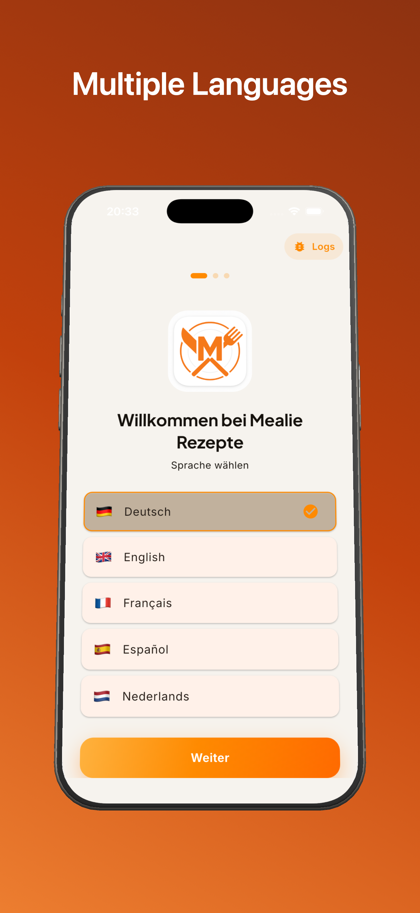
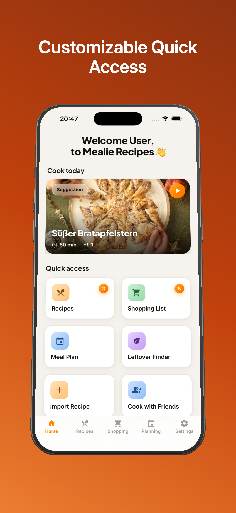
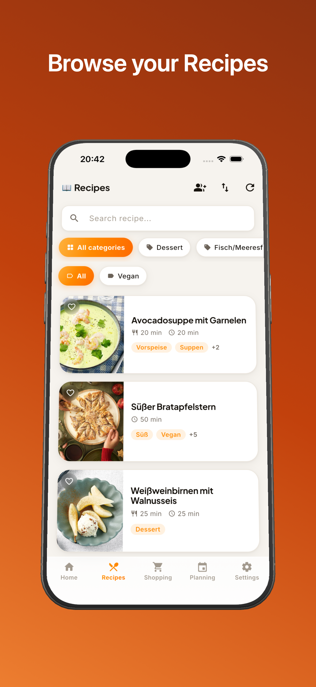
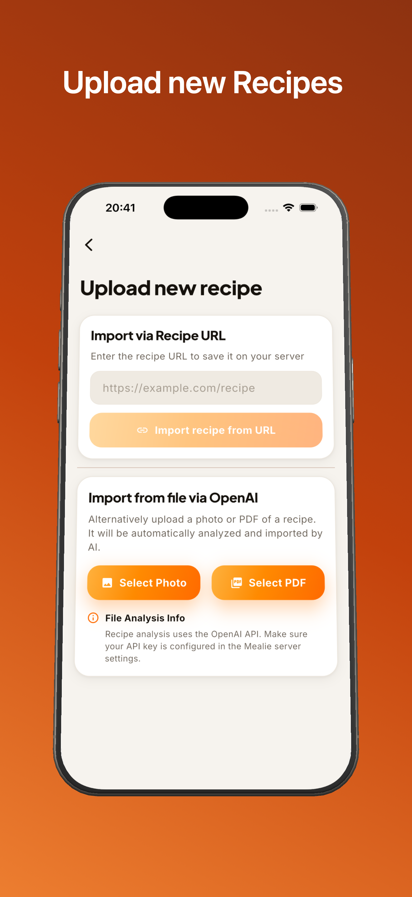
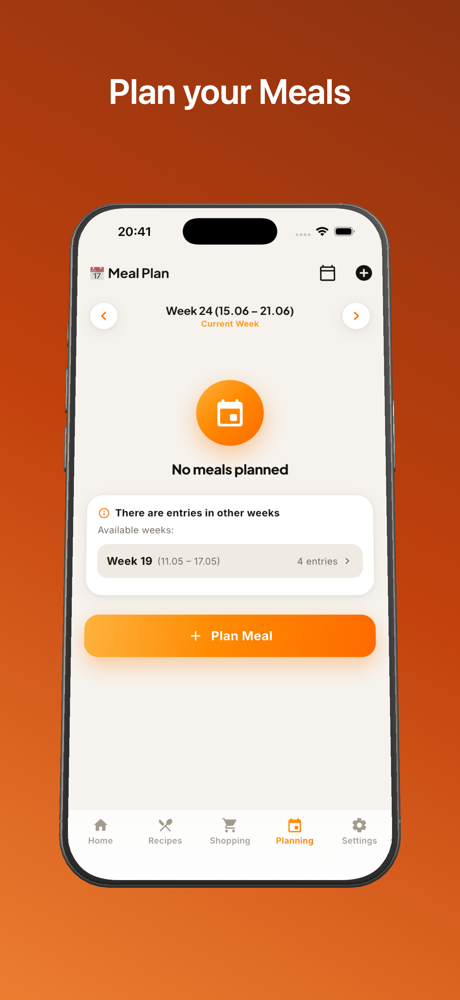
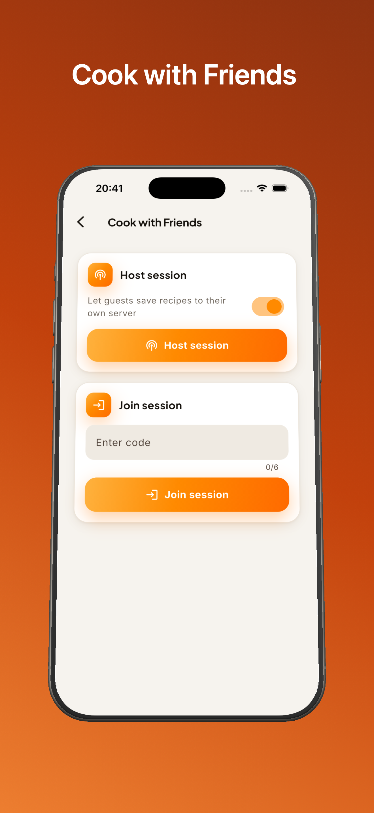
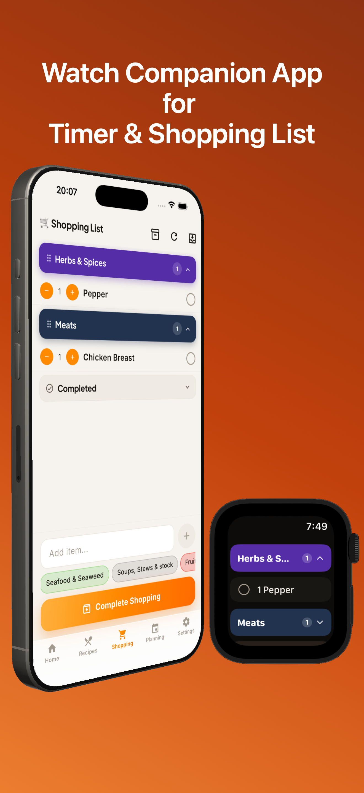

# 🍳 Mealie Recipes – The App for Your Mealie Server

-0078D6)
-black)

**🌍 Language / Sprache:** [🇬🇧 English](#-english) · [🇩🇪 Deutsch](#-deutsch)

> ⚠️ **Note / Hinweis:** This is a third-party app and not an official product of the Mealie project; it requires your own running Mealie server. · Dies ist eine Drittanbieter-App und kein offizielles Mealie-Produkt; sie benötigt einen eigenen, laufenden Mealie-Server.

---

## 🇬🇧 English

**Manage your recipes seamlessly with your own Mealie server.** Mealie Recipes is the companion for everyone who self-hosts Mealie and wants a fast, beautiful, native-feeling app — on your phone, your tablet, your smartwatch and now also on your **Windows PC and Mac**. Built with Flutter for a consistent experience across every platform, offline-first, in 10 languages.

☕ **Support appreciated** — if you like the app, I'd appreciate a small contribution on [Buy Me a Coffee](https://buymeacoffee.com/walfrosch92).

### Table of Contents

- [✨ Features](#features)
  - [📖 Discover & manage recipes](#f-recipes)
  - [✏️ Recipe editor](#f-editor)
  - [📥 Import recipes](#f-import)
  - [⏱️ Cooking mode & timers](#f-timers)
  - [⌚ Watch apps](#f-watch)
  - [🛒 Shopping list](#f-shopping)
  - [📅 Meal plan](#f-mealplan)
  - [🔎 Recipe finder](#f-finder)
  - [📚 Cookbooks, timeline & organizing](#f-organize)
  - [🤝 Share & cook together](#f-share)
  - [🏠 Home screen, widgets & tiles](#f-home)
  - [👥 Users, households & permissions](#f-users)
  - [🔐 Security & sign-in](#f-security)
  - [⚙️ Settings & personalization](#f-settings)
- [🖥️ Windows & macOS](#desktop)
- [📸 Screenshots](#screenshots)
- [📱 Compatibility & requirements](#requirements)
- [🔒 Privacy & security](#privacy)
- [🛠 Technology](#technology)
- [⬇️ Download & installation](#download)
- [🔗 Links](#links)

### ✨ Features

The app turns your recipe database into an interactive cooking experience — and works **offline-first**: everything is shown instantly from the local cache and synced with your server in the background.

#### 📖 Discover & manage recipes

- **Search, filter & sort:** Full-text search plus filters for categories, tags, tools, foods and households (with Mealie's "contains all / any" logic), sort sheet, random recipe dice
- **Recipe detail:** Hero image with full-screen viewer, ingredients (incl. ingredient sections) and instructions, times, servings scaling, nutrition, rating
- **Rate & favorite:** Star rating and favorites list
- **Notes, comments & attachments:** Edit recipe notes inline, read and write comments, open recipe attachments (PDF, images, files)
- **Timeline:** "I made this" entries with optional photo, per recipe and across all recipes; "last made" date
- **Linked recipes:** Sub-recipes inside a recipe are recognized
- **Export & share:** Export a recipe as PDF (image embedded), send it to other devices
- **Unlimited offline cache:** All recipes are available offline; optionally store all recipe images offline too
- **Lock & delete:** Mirrors Mealie's permissions (only the creator or an admin may delete; locked recipes can't be edited by others)

#### ✏️ Recipe editor

- **Web-app parity:** Name, description, image (camera/gallery/URL), times, servings & yield, categories, tags, tools, nutrition, settings, original URL
- **Ingredients:** Quantity, unit and food with autocomplete, ingredient sections, alternatives and note links (depending on your Mealie version), ingredient parser to repair unparsed recipes
- **Instructions:** Reorder, sections, linked ingredients
- **Safe saving:** Only changed fields are sent to the server — nothing the app doesn't know about gets lost
- **JSON editor** for power users

#### 📥 Import recipes

- **From URL:** Mealie's built-in scraper
- **AI import:** URLs **including recipe videos**, with live progress (Mealie 3.23+; video import from 3.13)
- **From photos & PDFs:** Several pages per recipe (camera, gallery, PDF) — processed by your Mealie server's AI provider
- **Share sheet:** Share a website from Safari/Chrome straight into the app (iOS & Android)
- **Import language:** Choose the target language of AI imports independently of the app language (37 languages)
- **Create manually**

#### ⏱️ Cooking mode & timers

- **Step-focused view:** Prepare ingredients → steps → done, with progress indicator and scaled amounts
- **Smart timers:** Detected automatically from the instruction text (multilingual), several timers in parallel, pause/resume/stop
- **Notifications & alarm:** Local notification and alarm sound when a timer finishes
- **Live Activity (iOS):** Dynamic Island and lock screen
- **Ongoing notification (Android)**
- **Keep screen on** while cooking
- **Multi-recipe sessions:** Cook several recipes at once
- **Finish page:** Mark the recipe as cooked (timeline entry + optional photo) and leave a comment

#### ⌚ Watch apps

- **Apple Watch & Wear OS**, in all 10 app languages
- **Cooking mode on the wrist:** Previous/next step buttons and all running timers (swipeable), pause/stop, alarm with haptics
- **Shopping list on the wrist:** Open items grouped by category with colors, tap to check off
- **Wear OS tiles**

#### 🛒 Shopping list

- **Several lists:** Switch, create, rename, delete, archive
- **Categories (labels):** Colored grouping, custom order per list
- **Exact quantities mode:** Mirrors the web app 1:1 (quantity + unit + food), or a simple "buy one" view
- **Smart adding:** Quantity/unit/food entry with catalog autocomplete; add all or selected ingredients from a recipe; ingredients marked "on hand" are skipped
- **Linked recipes:** See which recipes items came from
- **Shopping reminder:** Up to 3 store locations — a notification reminds you when you're nearby and the list has open items (works even when the app is closed)
- **Imports:** Apple Reminders (iOS) and Google Tasks (Android)
- **Offline:** Changes are queued and synced later

#### 📅 Meal plan

- **Week view:** Navigate weeks, jump to today, select several entries
- **Plan meals:** Breakfast, lunch, dinner, side — search with thumbnails and sorting
- **Random dice:** Suggestions by category keywords or by your **Mealie meal plan rules** (create and edit rules in the app)
- **Add to shopping list** directly from the plan

#### 🔎 Recipe finder

- **Cook with what you have:** Select foods and tools → Mealie suggests matching recipes, including missing items (works offline with a local fallback)

#### 📚 Cookbooks, timeline & organizing

- **Cookbooks:** Browse, create and edit with a filter builder (categories, tags, tools, foods, households, users, …)
- **Organizers:** Manage categories, tags and tools
- **Data management:** Foods, units (incl. merge and seed data) and labels
- **Timeline** across all recipes

#### 🤝 Share & cook together

- **Cook with Friends:** Shared cooking session over the local network (iOS ↔ Android), invite via code
- **Send to device:** Send recipes to nearby devices or to your other devices — delivered later via your Mealie server if the recipient is offline
- **Guest mode:** Use Cook with Friends without your own server

#### 🏠 Home screen, widgets & tiles

- **"Cook today" carousel:** Meals planned for today or a recipe of the day
- **Tiles:** Pin up to 8 tiles (incl. "More"), reorder via drag & drop; "More" contains all functions
- **Home-screen widgets (iOS & Android):** Shopping list and meal plan, refresh themselves, in all 10 languages

#### 👥 Users, households & permissions

- **Your profile:** Name, username, email, profile picture, password
- **User management** (depending on permissions): Create, edit and delete users, password-reset links, unlock users, invite via link or email
- **Households & groups:** Preferences, admin management
- **Permissions:** Mealie's permissions are mirrored — functions you're not allowed to use are hidden

#### 🔐 Security & sign-in

- **Sign-in:** Username & password (the app creates an API token) or an API token (e.g. for OIDC/LDAP users), connection test
- **Biometric app lock:** Face ID / Touch ID / fingerprint
- **Secure storage:** The token is stored in the system keychain / keystore

#### ⚙️ Settings & personalization

- **10 languages:** German, English, Spanish, French, Hungarian, Norwegian (Bokmål), Dutch, Polish, Portuguese (Brazil), Slovenian — Mealie terms named exactly like in the Mealie web app
- **Theme:** System / light / dark
- **App icon:** Classic or Modern, with dark and tinted variants (iOS)
- **Connection:** Server URL, household, optional extra HTTP headers (e.g. Cloudflare Access)
- **"What's new"** after every update
- **Logs & support:** View/copy logs, contact support with the log attached

### 🖥️ Windows & macOS

The desktop apps contain **all features of the mobile app** (except phone-only hardware features such as notifications, geofence reminder, camera, widgets and watch) and turn Mealie Recipes into a **complete Mealie web-app client**:

- **Large-screen layout:** Resizable window, multi-column tiles and recipe grid, taller "Cook today" image, centered reading column for recipes, shopping list, meal plan and settings
- **Bulk URL import:** Many recipe URLs at once (paste one per line), optionally with categories and tags, including import reports
- **Import from ZIP:** Recipes exported from another Mealie instance
- **Data migration:** Import from Paprika, Tandoor, Nextcloud Cookbook, Copy Me That, Plan to Eat, Recipe Keeper, My Recipe Box, Chowdown, DVO Cook'n X3 and Mealie pre-v1.0
- **Recipe data (bulk actions):** Select recipes and tag, categorize, change settings, export or delete them; download and purge data exports
- **Per recipe:** Duplicate, public share links with expiration date, export as JSON or ZIP, run recipe actions
- **Recipe actions:** Create your own "link" and "post" actions (with placeholders such as `${slug}` or `${servings}`)
- **Webhooks:** Meal-plan webhooks with a scheduled time, test button
- **Notifiers:** Apprise notifications for recipe, meal-plan, shopping-list, cookbook, tag, category, label and user events
- **AI providers (Mealie 3.28+):** Create, edit, test and delete providers; choose the default, audio and image provider
- **Debug:** Ingredient parser playground (NLP / brute / OpenAI) with confidence values; AI provider test with optional image (admins)
- **Administration (admins):** Configuration checks, test email, site statistics and info, **backups** (create, upload, download, restore, delete), **maintenance** (storage details, cleanup actions)
- **Update checker:** Checks GitHub releases on start (can be turned off) and shows an orange badge — the update is only installed when you start it; the app then restarts automatically
- **macOS:** Native Apple Silicon build, signed and notarized by Apple, keeps the screen awake in cooking mode, uninstaller included in the disk image
- **Windows:** Installer without admin rights, uninstall via "Apps & features"

### 📸 Screenshots

| Setup | Home | Recipe list |
|:---:|:---:|:---:|
|  |  |  |

| Add a recipe | Meal plan | Cook with Friends |
|:---:|:---:|:---:|
|  |  |  |

| &nbsp; | Shopping list & Apple Watch | &nbsp; |
|:---:|:---:|:---:|
| |  | |

### 📱 Compatibility & requirements

**Phones & tablets**
- **Android:** Android 7.0 (API level 24) or newer
- **iOS:** iOS 17.6 or newer (home-screen widgets require iOS 18.6)

**Smartwatches**
- **watchOS:** watchOS 10.0 or newer (Apple Watch)
- **Wear OS:** Wear OS 3.0 or newer (API level 30)

**Desktop**
- **Windows:** Windows 10 or 11, 64-bit
- **macOS:** macOS 12 Monterey or newer on Apple Silicon (M1 or newer)

**Server**
- A running [Mealie](https://mealie.io/) server (v2.8 or v3; some functions such as AI video import or AI providers need a newer Mealie version)

### 🔒 Privacy & security

- **No data collection:** The developer collects **no data** from you. No tracking, no analytics, no ads.
- **Direct connection:** The app talks directly to your own Mealie server; your recipes, shopping lists and plans live on your server.
- **AI import:** Image, PDF, video and AI URL imports are sent to **your Mealie server**. Only if that server is configured with an AI provider does that provider process the data — the app itself never talks to an AI service. For the AI path, please review your provider's policies.
- **Local network:** Cook with Friends and Send to device use your local network (Bonjour/mDNS) only.
- **Shopping reminder:** Your saved store locations stay on the device; location is only used to trigger the reminder.
- **Desktop update check:** The Windows and macOS apps ask `api.github.com` for the newest release of this repository (can be turned off). No personal data is transmitted.
- **Local data:** Connection settings, the API token (in the secure keychain/keystore) and a cache for fast/offline display.

### 🛠 Technology

Built with **Flutter**, Google's cross-platform framework:

- **High performance:** Dart is ahead-of-time compiled to native machine code; Flutter draws the UI with its own rendering engine (Impeller/Skia)
- **One codebase, six platforms:** Android, iOS, Windows, macOS plus native watch apps (SwiftUI for watchOS, Jetpack Compose for Wear OS)
- **Native integrations:** Live Activities & Dynamic Island, widgets, Share Extension, geofencing, Keychain/Keystore, CloudKit

### ⬇️ Download & installation

**Phones & tablets** — free in the official stores:

  
  &nbsp;&nbsp;
  

**Windows & macOS** — free on the [**Releases page**](https://github.com/Walfrosch92/Mealie-Recipes-APP/releases/latest):

- **macOS:** Download `MealieRecipes-x.y.z-arm64.dmg`, open it and drag **Mealie Recipes** into **Applications**. To remove the app, run **Uninstall Mealie Recipes** from the disk image (removes the app and all of its data).
- **Windows:** Download `MealieRecipes-x.y.z-windows-setup.exe` and run it (no admin rights needed). Uninstall via **Settings → Apps → Installed apps**.
- **Updates:** Both desktop apps check for new releases themselves (tile **"Check for updates"**).

### 🔗 Links

- [Mealie Server](https://mealie.io/)
- [Mealie AI providers](https://docs.mealie.io/documentation/getting-started/installation/ai-providers/)
- [Releases (Windows & macOS)](https://github.com/Walfrosch92/Mealie-Recipes-APP/releases)
- [Report a problem](https://github.com/Walfrosch92/Mealie-Recipes-APP/issues)
- [Flutter Framework](https://flutter.dev/)

Made with 🧡 by **Walfrosch92**

[⬆ Back to top](#top)

---

## 🇩🇪 Deutsch

**Verwalte deine Rezepte nahtlos mit deinem eigenen Mealie-Server.** Mealie Recipes ist der Begleiter für alle, die Mealie selbst hosten und eine schnelle, schöne, native App wollen – auf Smartphone, Tablet, Smartwatch und jetzt auch auf **Windows-PC und Mac**. Entwickelt mit Flutter für ein einheitliches Erlebnis auf allen Plattformen, offline-first, in 10 Sprachen.

☕ **Unterstützung willkommen** — wenn dir die App gefällt, freue ich mich über eine kleine Unterstützung auf [Buy Me a Coffee](https://buymeacoffee.com/walfrosch92).

### Inhaltsverzeichnis

- [✨ Funktionen](#de-features)
  - [📖 Rezepte entdecken & verwalten](#de-f-recipes)
  - [✏️ Rezept-Editor](#de-f-editor)
  - [📥 Rezepte importieren](#de-f-import)
  - [⏱️ Kochmodus & Timer](#de-f-timers)
  - [⌚ Uhren-Apps](#de-f-watch)
  - [🛒 Einkaufsliste](#de-f-shopping)
  - [📅 Essensplan](#de-f-mealplan)
  - [🔎 Rezept-Suche](#de-f-finder)
  - [📚 Kochbücher, Zeitleiste & Organisieren](#de-f-organize)
  - [🤝 Teilen & gemeinsam kochen](#de-f-share)
  - [🏠 Startbildschirm, Widgets & Kacheln](#de-f-home)
  - [👥 Benutzer, Haushalte & Rechte](#de-f-users)
  - [🔐 Sicherheit & Anmeldung](#de-f-security)
  - [⚙️ Einstellungen & Personalisierung](#de-f-settings)
- [🖥️ Windows & macOS](#de-desktop)
- [📸 Screenshots](#de-screenshots)
- [📱 Kompatibilität & Anforderungen](#de-requirements)
- [🔒 Datenschutz & Sicherheit](#de-privacy)
- [🛠 Technologie](#de-technology)
- [⬇️ Download & Installation](#de-download)
- [🔗 Links](#de-links)

### ✨ Funktionen

Die App verwandelt deine Rezeptdatenbank in ein interaktives Kocherlebnis – und arbeitet **offline-first**: Alles erscheint sofort aus dem lokalen Speicher und wird im Hintergrund mit deinem Server abgeglichen.

#### 📖 Rezepte entdecken & verwalten

- **Suchen, filtern & sortieren:** Volltextsuche plus Filter nach Kategorien, Schlagworten, Utensilien, Lebensmitteln und Haushalten (mit Mealies „alle / irgendeines enthalten"), Sortier-Sheet, Zufalls-Würfel
- **Rezept-Detail:** Titelbild mit Vollbildansicht, Zutaten (inkl. Zutaten-Abschnitten) und Zubereitung, Zeiten, Portionen-Skalierung, Nährwerte, Bewertung
- **Bewerten & Favorisieren:** Sterne-Bewertung und Favoritenliste
- **Notizen, Kommentare & Anhänge:** Rezept-Notizen direkt bearbeiten, Kommentare lesen und schreiben, Anhänge öffnen (PDF, Bilder, Dateien)
- **Zeitleiste:** „Ich hab's gekocht"-Einträge mit optionalem Foto, pro Rezept und rezeptübergreifend; Datum „zuletzt gekocht"
- **Verknüpfte Rezepte:** Unterrezepte innerhalb eines Rezepts werden erkannt
- **Exportieren & teilen:** Rezept als PDF (mit Bild) exportieren, an andere Geräte senden
- **Unbegrenzter Offline-Speicher:** Alle Rezepte offline verfügbar; auf Wunsch auch alle Rezeptbilder
- **Sperren & löschen:** Mealie-Rechte gespiegelt (löschen nur Ersteller oder Admin; gesperrte Rezepte können andere nicht bearbeiten)

#### ✏️ Rezept-Editor

- **Wie die Webapp:** Name, Beschreibung, Bild (Kamera/Galerie/URL), Zeiten, Portionen & Ergibt, Kategorien, Schlagworte, Utensilien, Nährwerte, Einstellungen, Original-URL
- **Zutaten:** Menge, Einheit und Lebensmittel mit Autovervollständigung, Zutaten-Abschnitte, Alternativen und Notiz-Links (je nach Mealie-Version), Zutaten-Parser zum Reparieren ungeparster Rezepte
- **Zubereitung:** Schritte umsortieren, Abschnitte, verknüpfte Zutaten
- **Sicheres Speichern:** Nur geänderte Felder gehen an den Server – nichts, was die App nicht kennt, geht verloren
- **JSON-Editor** für Fortgeschrittene

#### 📥 Rezepte importieren

- **Per URL:** Mealies eingebauter Scraper
- **KI-Import:** URLs **inklusive Rezeptvideos**, mit Live-Fortschritt (Mealie 3.23+; Video-Import ab 3.13)
- **Aus Fotos & PDFs:** Mehrere Seiten pro Rezept (Kamera, Galerie, PDF) – verarbeitet vom KI-Anbieter deines Mealie-Servers
- **Teilen-Menü:** Webseite aus Safari/Chrome direkt in die App teilen (iOS & Android)
- **Importsprache:** Zielsprache des KI-Imports unabhängig von der App-Sprache wählbar (37 Sprachen)
- **Manuell anlegen**

#### ⏱️ Kochmodus & Timer

- **Schrittfokussierte Ansicht:** Zutaten vorbereiten → Schritte → Fertig, mit Fortschrittsanzeige und skalierten Mengen
- **Intelligente Timer:** Automatisch aus dem Anleitungstext erkannt (mehrsprachig), mehrere Timer parallel, Pause/Fortsetzen/Stopp
- **Benachrichtigungen & Alarm:** Lokale Benachrichtigung und Alarmton bei Ablauf
- **Live Activity (iOS):** Dynamic Island und Sperrbildschirm
- **Laufende Benachrichtigung (Android)**
- **Display bleibt an** beim Kochen
- **Mehrere Rezepte gleichzeitig** kochen
- **Abschlussseite:** Rezept als gekocht markieren (Zeitleisten-Eintrag + optionales Foto) und kommentieren

#### ⌚ Uhren-Apps

- **Apple Watch & Wear OS**, in allen 10 App-Sprachen
- **Kochmodus am Handgelenk:** Vor/Zurück-Tasten für die Schritte und alle laufenden Timer (wischbar), Pause/Stopp, Alarm mit Vibration
- **Einkaufsliste am Handgelenk:** Offene Artikel nach Kategorie mit Farben, per Tippen abhaken
- **Wear-OS-Kacheln**

#### 🛒 Einkaufsliste

- **Mehrere Listen:** Wechseln, anlegen, umbenennen, löschen, archivieren
- **Kategorien (Bezeichnungen):** Farbige Gruppierung, eigene Reihenfolge je Liste
- **Exakte Mengen:** 1:1 wie die Webapp (Menge + Einheit + Lebensmittel) oder einfache „1× kaufen"-Ansicht
- **Komfortables Hinzufügen:** Menge/Einheit/Lebensmittel mit Katalog-Autovervollständigung; alle oder ausgewählte Zutaten aus einem Rezept; als „vorrätig" markierte Zutaten werden übersprungen
- **Verknüpfte Rezepte:** Sehen, aus welchen Rezepten Artikel stammen
- **Einkaufserinnerung:** Bis zu 3 Geschäfte – eine Benachrichtigung erinnert dich in der Nähe, wenn die Liste offene Artikel hat (auch bei geschlossener App)
- **Importe:** Apple Erinnerungen (iOS) und Google Tasks (Android)
- **Offline:** Änderungen werden gesammelt und später abgeglichen

#### 📅 Essensplan

- **Wochenansicht:** Wochen wechseln, zu heute springen, mehrere Einträge auswählen
- **Mahlzeiten planen:** Frühstück, Mittag, Abendessen, Beilage – Suche mit Vorschaubildern und Sortierung
- **Zufalls-Würfel:** Vorschläge nach Kategorie-Stichwörtern oder nach deinen **Mealie-Essensplan-Regeln** (Regeln in der App anlegen und bearbeiten)
- **Auf die Einkaufsliste** direkt aus dem Plan

#### 🔎 Rezept-Suche

- **Kochen mit dem, was da ist:** Lebensmittel und Utensilien wählen → Mealie schlägt passende Rezepte vor, inkl. fehlender Zutaten (offline mit lokalem Ersatz)

#### 📚 Kochbücher, Zeitleiste & Organisieren

- **Kochbücher:** Ansehen, anlegen und bearbeiten mit Filter-Baukasten (Kategorien, Schlagworte, Utensilien, Lebensmittel, Haushalte, Benutzer …)
- **Organisieren:** Kategorien, Schlagworte und Utensilien verwalten
- **Datenverwaltung:** Lebensmittel, Einheiten (inkl. Zusammenführen und Musterdaten) und Bezeichnungen
- **Zeitleiste** über alle Rezepte

#### 🤝 Teilen & gemeinsam kochen

- **Kochen mit Freunden:** Gemeinsame Kochsession im lokalen Netzwerk (iOS ↔ Android), Einladung per Code
- **Senden an:** Rezepte an Geräte in der Nähe oder an deine anderen Geräte senden – ist der Empfänger offline, wird über deinen Mealie-Server später zugestellt
- **Gastmodus:** Kochen mit Freunden auch ohne eigenen Server

#### 🏠 Startbildschirm, Widgets & Kacheln

- **„Heute kochen"-Karussell:** Heute geplante Mahlzeiten oder ein Rezept des Tages
- **Kacheln:** Bis zu 8 Kacheln anpinnen (inkl. „Weiteres"), per Ziehen umsortieren; „Weiteres" enthält alle Funktionen
- **Homescreen-Widgets (iOS & Android):** Einkaufsliste und Essensplan, aktualisieren sich selbst, in allen 10 Sprachen

#### 👥 Benutzer, Haushalte & Rechte

- **Eigenes Profil:** Name, Benutzername, E-Mail, Profilbild, Passwort
- **Benutzerverwaltung** (je nach Recht): Benutzer anlegen, bearbeiten, löschen, Passwort-Reset-Links, gesperrte Benutzer freigeben, Einladen per Link oder E-Mail
- **Haushalte & Gruppen:** Einstellungen, Admin-Verwaltung
- **Rechte:** Mealies Rechte werden gespiegelt – Funktionen ohne Berechtigung sind ausgeblendet

#### 🔐 Sicherheit & Anmeldung

- **Anmeldung:** Benutzername & Passwort (die App erzeugt ein API-Token) oder API-Token (z. B. für OIDC/LDAP), Verbindungstest
- **Biometrische App-Sperre:** Face ID / Touch ID / Fingerabdruck
- **Sichere Speicherung:** Das Token liegt im System-Schlüsselbund / Keystore

#### ⚙️ Einstellungen & Personalisierung

- **10 Sprachen:** Deutsch, Englisch, Spanisch, Französisch, Ungarisch, Norwegisch (Bokmål), Niederländisch, Polnisch, Portugiesisch (Brasilien), Slowenisch – Mealie-Begriffe genau wie in der Mealie-Webapp
- **Design:** System / Hell / Dunkel
- **App-Icon:** Classic oder Modern, mit dunkler und getönter Variante (iOS)
- **Verbindung:** Server-URL, Haushalt, optionale zusätzliche HTTP-Header (z. B. Cloudflare Access)
- **„Was ist neu"** nach jedem Update
- **Logs & Support:** Logs ansehen/kopieren, Support kontaktieren mit Log im Anhang

### 🖥️ Windows & macOS

Die Desktop-Apps enthalten **alle Funktionen der Handy-App** (außer handy-spezifischen wie Benachrichtigungen, Einkaufserinnerung, Kamera, Widgets und Uhr) und machen Mealie Recipes zum **vollständigen Mealie-Webapp-Client**:

- **Großbild-Layout:** Frei skalierbares Fenster, mehrspaltige Kacheln und Rezept-Raster, höheres „Heute kochen"-Bild, zentrierte Lesespalte für Rezepte, Einkaufsliste, Essensplan und Einstellungen
- **URL-Massenimport:** Viele Rezept-URLs auf einmal (eine pro Zeile einfügen), optional mit Kategorien und Schlagworten, inkl. Import-Berichten
- **Import aus ZIP:** Aus einer anderen Mealie-Instanz exportierte Rezepte
- **Datenmigration:** Import aus Paprika, Tandoor, Nextcloud Cookbook, Copy Me That, Plan to Eat, Recipe Keeper, My Recipe Box, Chowdown, DVO Cook'n X3 und Mealie vor v1.0
- **Rezeptdaten (Massenaktionen):** Rezepte auswählen und verschlagworten, kategorisieren, Einstellungen ändern, exportieren oder löschen; Daten-Exporte herunterladen und bereinigen
- **Pro Rezept:** Duplizieren, öffentliche Freigabe-Links mit Ablaufdatum, Export als JSON oder ZIP, Rezept-Aktionen ausführen
- **Rezept-Aktionen:** Eigene „Link"- und „Posten"-Aktionen anlegen (mit Platzhaltern wie `${slug}` oder `${servings}`)
- **Webhooks:** Essensplan-Webhooks mit Uhrzeit, Test-Knopf
- **Benachrichtigungen:** Apprise-Benachrichtigungen bei Rezept-, Essensplan-, Einkaufslisten-, Kochbuch-, Schlagwort-, Kategorie-, Bezeichnungs- und Benutzer-Ereignissen
- **KI-Anbieter (Mealie 3.28+):** Anbieter anlegen, bearbeiten, testen und löschen; Standard-, Audio- und Bild-Anbieter festlegen
- **Debug:** Zutaten-Parser zum Ausprobieren (NLP / Brute / OpenAI) mit Trefferquote; KI-Anbieter-Test mit optionalem Bild (Admins)
- **Administration (Admins):** Konfigurations-Prüfungen, Test-E-Mail, Website-Statistik und -Infos, **Sicherungen** (erstellen, hochladen, herunterladen, wiederherstellen, löschen), **Wartung** (Speicherdetails, Aufräum-Aktionen)
- **Update-Prüfer:** Sucht beim Start nach neuen GitHub-Releases (abschaltbar) und zeigt eine orange Markierung – installiert wird erst, wenn du das Update startest; danach startet die App automatisch neu
- **macOS:** Native Apple-Silicon-App, von Apple signiert und notarisiert, Display bleibt im Kochmodus an, Deinstaller im Disk-Image enthalten
- **Windows:** Installer ohne Admin-Rechte, Deinstallieren über „Apps & Features"

### 📸 Screenshots

| Einrichtung | Startseite | Rezeptliste |
|:---:|:---:|:---:|
|  |  |  |

| Rezept hinzufügen | Essensplan | Kochen mit Freunden |
|:---:|:---:|:---:|
|  |  |  |

| &nbsp; | Einkaufsliste & Apple Watch | &nbsp; |
|:---:|:---:|:---:|
| |  | |

### 📱 Kompatibilität & Anforderungen

**Smartphones & Tablets**
- **Android:** Android 7.0 (API-Level 24) oder neuer
- **iOS:** iOS 17.6 oder neuer (Homescreen-Widgets benötigen iOS 18.6)

**Smartwatches**
- **watchOS:** watchOS 10.0 oder neuer (Apple Watch)
- **Wear OS:** Wear OS 3.0 oder neuer (API-Level 30)

**Desktop**
- **Windows:** Windows 10 oder 11, 64-Bit
- **macOS:** macOS 12 Monterey oder neuer auf Apple Silicon (M1 oder neuer)

**Server**
- Ein laufender [Mealie](https://mealie.io/)-Server (v2.8 oder v3; manche Funktionen wie KI-Video-Import oder KI-Anbieter brauchen eine neuere Mealie-Version)

### 🔒 Datenschutz & Sicherheit

- **Keine Datenerfassung:** Der Entwickler erfasst **keinerlei Daten** von dir. Kein Tracking, keine Analytics, keine Werbung.
- **Direkte Verbindung:** Die App spricht direkt mit deinem eigenen Mealie-Server; deine Rezepte, Einkaufslisten und Pläne liegen auf deinem Server.
- **KI-Import:** Bild-, PDF-, Video- und KI-URL-Importe gehen an **deinen Mealie-Server**. Nur wenn dort ein KI-Anbieter eingerichtet ist, verarbeitet dieser die Daten – die App selbst spricht nie mit einem KI-Dienst. Beachte für den KI-Pfad die Richtlinien deines Anbieters.
- **Lokales Netzwerk:** Kochen mit Freunden und Senden an nutzen nur dein lokales Netzwerk (Bonjour/mDNS).
- **Einkaufserinnerung:** Deine gespeicherten Geschäfte bleiben auf dem Gerät; der Standort wird nur zum Auslösen der Erinnerung genutzt.
- **Update-Prüfung (Desktop):** Die Windows- und macOS-App fragen bei `api.github.com` das neueste Release dieses Repositorys ab (abschaltbar). Dabei werden keine persönlichen Daten übertragen.
- **Lokale Daten:** Verbindungseinstellungen, das API-Token (im sicheren Schlüsselbund/Keystore) und ein Speicher für schnelle bzw. Offline-Anzeige.

### 🛠 Technologie

Entwickelt mit **Flutter**, Googles plattformübergreifendem Framework:

- **Hohe Performance:** Dart wird vorab (AOT) zu nativem Maschinencode kompiliert; Flutter zeichnet die Oberfläche mit eigener Render-Engine (Impeller/Skia)
- **Eine Codebasis, sechs Plattformen:** Android, iOS, Windows, macOS plus native Uhren-Apps (SwiftUI für watchOS, Jetpack Compose für Wear OS)
- **Native Integrationen:** Live Activities & Dynamic Island, Widgets, Share Extension, Geofencing, Schlüsselbund/Keystore, CloudKit

### ⬇️ Download & Installation

**Smartphones & Tablets** — kostenlos in den offiziellen Stores:

  
  &nbsp;&nbsp;
  

**Windows & macOS** — kostenlos auf der [**Releases-Seite**](https://github.com/Walfrosch92/Mealie-Recipes-APP/releases/latest):

- **macOS:** `MealieRecipes-x.y.z-arm64.dmg` herunterladen, öffnen und **Mealie Recipes** in **Programme** ziehen. Zum Entfernen **Uninstall Mealie Recipes** aus dem Disk-Image starten (entfernt App und alle Daten).
- **Windows:** `MealieRecipes-x.y.z-windows-setup.exe` herunterladen und ausführen (keine Admin-Rechte nötig). Deinstallieren über **Einstellungen → Apps → Installierte Apps**.
- **Updates:** Beide Desktop-Apps suchen selbst nach neuen Releases (Kachel **„Nach Updates suchen"**).

### 🔗 Links

- [Mealie Server](https://mealie.io/)
- [Mealie KI-Anbieter](https://docs.mealie.io/documentation/getting-started/installation/ai-providers/)
- [Releases (Windows & macOS)](https://github.com/Walfrosch92/Mealie-Recipes-APP/releases)
- [Problem melden](https://github.com/Walfrosch92/Mealie-Recipes-APP/issues)
- [Flutter Framework](https://flutter.dev/)

Entwickelt mit 🧡 von **Walfrosch92**

[⬆ Nach oben](#top)
